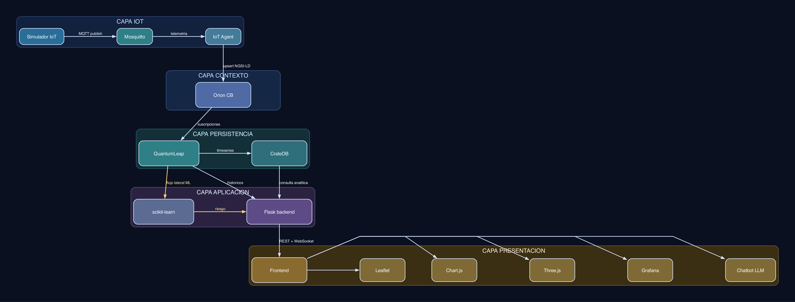
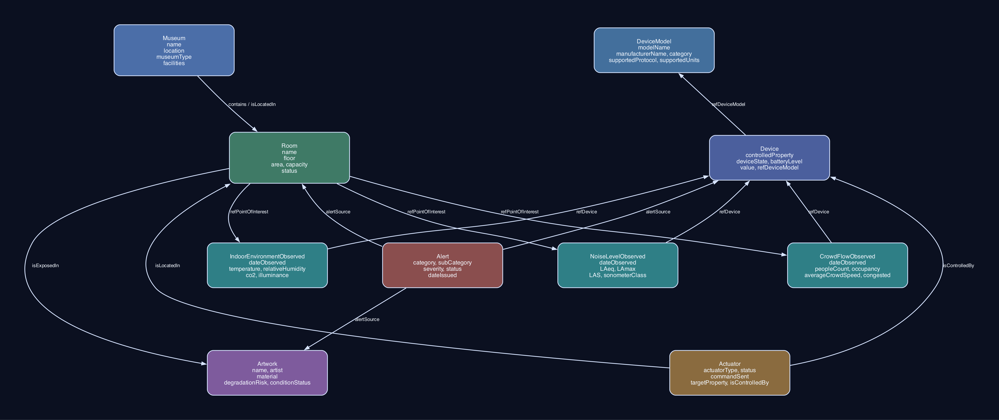

## 1. Objetivo

AuraVault es una aplicacion FIWARE orientada a la monitorización ambiental de centros culturales de interior y a la conservación preventiva de obras. Su objetivo es convertir lecturas IoT en decisiones operativas para tres perfiles: Gestor, Conservador y Visitante.

La plataforma integra datos en tiempo real, históricos y analítica aplicada para:

- vigilar confort ambiental y ocupación por centro y por sala,
- detectar desviaciones con impacto en conservación,
- priorizar riesgos sobre obras sensibles,
- apoyar respuestas operativas con actuadores,
- ofrecer una vista pública clara y útil para visitante.

El sistema se fundamenta en NGSI-LD para mantener trazabilidad semántica entre Museum, Room, Artwork, Device, observaciones, Alert y Actuator, con interoperabilidad extremo a extremo.

## 2. Estado del arte del dominio de aplicacion

En museos, teatros y salas de exposición, el control ambiental ha pasado de soluciones cerradas de tipo BMS a arquitecturas IoT con mayor interoperabilidad. Aún así, muchas plataformas comerciales siguen centradas en telemetría y alarmas simples, con limitaciones en tres frentes:

- baja estandarización semántica entre sensores, salas y activos culturales,
- debil conexión entre la medida ambiental y la obra afectada,
- dificultad para combinar operación diaria, histórico y comunicación pública en una misma experiencia.

AuraVault aborda estas brechas con una arquitectura FIWARE y modelo NGSI-LD unificado. Orion CB mantiene el estado contextual actual, QuantumLeap y CrateDB gestionan históricos temporales, e IoT Agent sobre MQTT integra dispositivos. Sobre esa base, Flask orquesta APIs, eventos y lógica de negocio para vistas operativas y de visitante.

El resultado es una solución de dominio cultural interior que integra monitorización, conservación, control y divulgación en una misma cadena de valor digital, manteniendo consistencia semántica y capacidad de evolución.

## 3. Funcionalidades principales

- Monitorización ambiental en tiempo real de centros, salas, obras y dispositivos.
- Vista global de estado, alertas, ocupación y tendencia operativa.
- Exploración geoespacial y comparativa entre centros culturales.
- Análisis histórico por rangos temporales para diagnóstico técnico.
- Gemelo digital 3D para inspección visual avanzada por sala.
- Seguimiento de riesgo de degradación de obras.
- Gestión de alertas y resolución operativa desde panel de control.
- Control de actuadores bajo reglas de seguridad y contexto.
- Modo visitante con lectura simplificada y recomendación de sala.
- Chatbot contextual con LLM local usando contexto NGSI-LD.

## 4. Funcionalidades detalladas (resumen del PRD.md)

Vista 1 - Dashboard Global: consolida KPIs de confort, ocupación, riesgo y estado de sensores; permite resolver alertas y navegar al detalle por centro. Incluye loaders visuales durante la carga de datos, mapa y gráficos para mejorar la experiencia de usuario, y un diagrama del modelo de datos NGSI-LD renderizado gráficamente en una tarjeta independiente.

Vista 2 - Explorador de Centros: presenta tarjetas comparables por estado ambiental, aforo y tendencia corta; incorpora filtros por tipo, estado y ocupación.

Vista 3 - Detalle del Centro: combina gauges en vivo, histórico multivariable, listado de salas y obras en riesgo, estado de actuadores y panel Grafana embebido.

Vista 4 - Gemelo Digital 3D: representa salas y variables ambientales con interacción (zoom, rotación, selección de sala) y actualización continua por eventos.

Vista 5 - Detalle de Sala y Obra: analiza condiciones actuales frente a rangos de conservación, histórico por obra, comparativa entre piezas y pasaporte ambiental exportable.

Vista 6 - Centro de Control: unifica administración de alertas y dispositivos, con estadísticas operativas, diagnóstico de flota y apoyo a predicción de fallo.

Vista 7 - Modo Visitante: ofrece una lectura pública, simple y móvil de calidad ambiental, ocupación y recomendación de sala, con consulta en lenguaje natural.

Capacidades transversales: tiempo real por WebSocket, consulta histórica, trazabilidad semántica entre entidades, exportación de información técnica y soporte bilingüe para experiencia pública.

## 5. Estado actual de la aplicación

- Las consultas repetidas al backend usan caché temporal para mejorar respuesta en vistas globales y de detalle.
- Si Orion no devuelve dato vivo, la aplicación consulta el histórico más reciente disponible para evitar pantallas vacías.
- La interfaz visualiza valores ausentes como ausencia de dato, no como cero artificial.
- El mapa global incorpora hover con contexto y navegación directa al detalle de centro.
- La vista de centros usa búsqueda de texto y tarjetas con imagen real de cada centro.
- El gemelo 3D y la vista de sala muestran información contextual en paneles laterales fijos, mejorando el uso de la pantalla.
- La vista pública y el panel de sala/obra usan soporte bilingüe para labels y mensajes principales.
- La ingesta de datos de Orion resuelve transparentemente los atributos encapsulados en arreglos, asegurando KPIs precisos.
- Las gráficas analíticas separan los ejes Y por magnitud para evitar superposición visual en el histórico.
- Sincronización en tiempo real (heartbeat 15s) mediante SocketIO, permitiendo actualizaciones de KPIs y alertas sin refresco manual.
- Interfaz premium con layouts responsivos que evitan el estiramiento de tarjetas y mejoran la jerarquía visual de la información operativa.
- Gestión automática de suscripciones Orion-LD que asegura la recepción inmediata de eventos ambientales y críticos.

## 6. Diagrama de la arquitectura

## 7. Diagrama del modelo de datos

