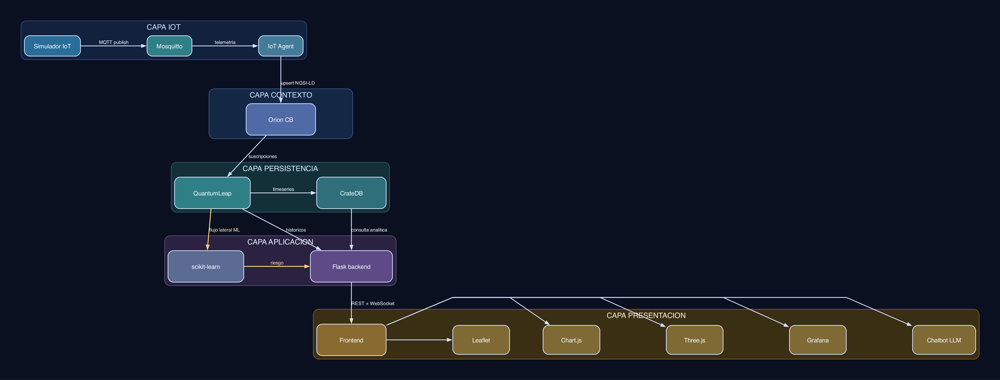
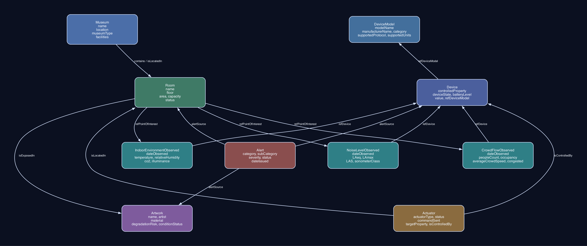

## 1. Objetivo

AuraVault es una aplicacion FIWARE orientada a la monitorización ambiental de centros culturales de interior y a la conservación preventiva de obras. Su objetivo es convertir lecturas IoT en decisiones operativas para tres perfiles: Gestor, Conservador y Visitante.

La plataforma integra datos en tiempo real, históricos y analítica aplicada para:

- vigilar confort ambiental y ocupación por centro y por sala,
- detectar desviaciones con impacto en conservación,
- priorizar riesgos sobre obras sensibles,
- apoyar respuestas operativas con actuadores,
- ofrecer una vista pública clara y útil para visitante.

El sistema se fundamenta en NGSI-LD para mantener trazabilidad semántica entre Museum, Room, Artwork, Device, observaciones, Alert y Actuator, con interoperabilidad extremo a extremo.

## 2. Estado del arte del dominio de aplicacion

En museos, teatros y salas de exposición, el control ambiental ha pasado de soluciones cerradas de tipo BMS a arquitecturas IoT con mayor interoperabilidad. Aún así, muchas plataformas comerciales siguen centradas en telemetría y alarmas simples, con limitaciones en tres frentes:

- baja estandarización semántica entre sensores, salas y activos culturales,
- debil conexión entre la medida ambiental y la obra afectada,
- dificultad para combinar operación diaria, histórico y comunicación pública en una misma experiencia.

AuraVault aborda estas brechas con una arquitectura FIWARE y modelo NGSI-LD unificado. Orion CB mantiene el estado contextual actual, QuantumLeap y CrateDB gestionan históricos temporales, e IoT Agent sobre MQTT integra dispositivos. Sobre esa base, Flask orquesta APIs, eventos y lógica de negocio para vistas operativas y de visitante.

El resultado es una solución de dominio cultural interior que integra monitorización, conservación, control y divulgación en una misma cadena de valor digital, manteniendo consistencia semántica y capacidad de evolución.

## 3. Funcionalidades principales

- Monitorización ambiental en tiempo real de centros, salas, obras y dispositivos.
- Vista global de estado, alertas, ocupación y tendencia operativa.
- Exploración geoespacial y comparativa entre centros culturales.
- Análisis histórico por rangos temporales para diagnóstico técnico.
- Gemelo digital 3D para inspección visual avanzada por sala.
- Seguimiento de riesgo de degradación de obras.
- Gestión de alertas y resolución operativa desde panel de control.
- Control de actuadores bajo reglas de seguridad y contexto.
- Modo visitante con lectura simplificada y chatbot contextual AuraBot (Gemini API).
- Internacionalización completa ES/EN con cambio instantáneo sin recarga de página, incluyendo gráficas, actuadores, paneles 3D y respuestas del chatbot.

## 4. Funcionalidades detalladas (resumen del PRD.md)

Vista 1 - Dashboard Global: consolida KPIs de confort, ocupación, riesgo y estado de sensores; permite resolver alertas y navegar al detalle por centro. Incluye loaders visuales durante la carga de datos, mapa y gráficos para mejorar la experiencia de usuario, y un diagrama del modelo de datos NGSI-LD renderizado gráficamente en una tarjeta independiente.

Vista 2 - Explorador de Centros: presenta tarjetas comparables por estado ambiental, aforo y tendencia corta; incorpora filtros por tipo, estado y ocupación.

Vista 3 - Detalle del Centro: combina gauges en vivo, histórico multivariable, listado de salas y obras en riesgo, estado de actuadores y panel Grafana embebido.

Vista 4 - Gemelo Digital 3D: representa salas y variables ambientales con interacción (zoom, rotación, selección de sala) y actualización continua por eventos.

Vista 5 - Detalle de Sala y Obra: analiza condiciones actuales frente a rangos de conservación, visualización ampliada interactiva en galería, seguimiento de estrés acumulado, y pasaporte ambiental exportable.

Vista 6 - Centro de Control: unifica administración de alertas y dispositivos, con estadísticas operativas, diagnóstico de flota y apoyo a predicción de fallo.

Vista 7 - Modo Visitante: ofrece una lectura pública, simple y móvil de calidad ambiental, ocupación y recomendación de sala, con consulta en lenguaje natural.

Capacidades transversales: tiempo real por WebSocket, consulta histórica, trazabilidad semántica entre entidades, exportación de información técnica y soporte bilingüe para experiencia pública.

## 5. Estado actual de la aplicación (consolidación final — 2026-05-13)

- **Imagenes locales**: Todas las salas usan imagenes JPEG propias servidas desde `/static/images/rooms/`. Las obras clave de Sargadelos, Goya, Brocos, Asorey, Lente Fresnel y Cornellis de Vos usan sus imagenes en `/static/images/artworks/`. El resto usa placeholders semanticos.
- **Simulador MQTT con alertas forzadas**: el simulador publica cada 30 segundos. Cada ~5 minutos, la sala designada de cada centro genera periodicamente alertas de "Humedad fuera de rango" o "CO2 elevado" de forma determinista, garantizando datos de alerta visibles en Grafana y en la interfaz.
- **Grafana auravault_control** consolidado con 7 paneles: se eliminaron "Pico de Aforo Urbano" y "Distribucion de Incidentes" y se incorporaron "Promedio de Humedad por Centro" (barchart) y "Evolucion Critica de CO2 >800 ppm" (timeseries). Todas las consultas SQL usan `time_index` y la tabla `etindoorenvironmentobserved`.
- **i18n ES/EN completo (CORRECCIÓN 3)**: El objeto `AURA.t` en `common.js` cubre el 100% de las cadenas de texto visibles para el usuario. `setLang()` despacha el evento `aura:langchange` al documento; cada módulo JS escucha este evento y re-renderiza sus componentes dinámicos (Chart.js, radares, actuadores, paneles 3D, vista visitante) sin recargar la página. Ninguna palabra hardcodeada en inglés o español queda en las vistas activas al cambiar el idioma.
- **Chatbot AuraBot multiidioma** (Modo Visitante): usa Gemini API (`gemini-2.5-flash`) con contexto en tiempo real de la sala o centro. Responde en el idioma activo (ES/EN) gracias al campo `lang` enviado desde el frontend y al system prompt dinámico en `app.py`. Basado en el modelo `gemini-2.5-flash` de Google, accedido como servicio cloud desde el backend Flask.
- **Refresco SocketIO universal**: el hilo de fondo del backend emite `"summary"` + `"update"` cada 30s. El endpoint `/notify` propaga eventos por entidad. Todas las vistas (Dashboard, Detalle de Centro/Sala, Control) suscriben al menos a `"update"` o `"summary"` para actualizarse sin recarga manual.
- Las consultas repetidas al backend usan caché temporal de 5s para asegurar frescura sin saturar Orion.
- Las gráficas analíticas separan ejes Y por magnitud para evitar superposición visual en el historico.
- Gestión automática de suscripciones Orion-LD garantiza recepción inmediata de eventos ambientales y criticos.

## 6. Diagrama de la arquitectura

## 7. Diagrama del modelo de datos

## Implementación — Issue #17

- Branch: `feature/issue-17-ui-artwork-cleanup`
- Commit: `55970aa` — Hugo — 2026-05-06 18:57:33 +0200

Resumen:

- Interfaz: glassmorphism aplicado globalmente; modo claro green-tinted con variables CSS reutilizables en `static/css/style.css`.
- Contenido: imágenes de salas y artworks corregidas y actualizadas en el catálogo; emojis en la tabla de `room_artwork`.
- Recomendación: crear PR y proceder al merge tras revisión visual rápida y tests de smoke en staging.
