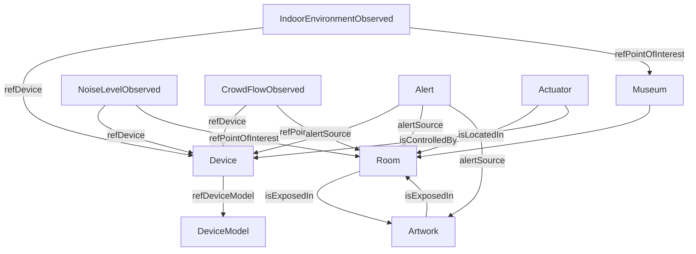

# data_model — AuraVault

## 1. Propósito y alcance

Este documento define el modelo de datos NGSI-LD de AuraVault. Su objetivo es dejar completamente especificadas las entidades, atributos, relaciones, identificadores, ejemplos e integración MQTT necesarios para que el sistema pueda implementarse sin ambigüedad.

AuraVault usa exclusivamente NGSI-LD. No se contempla NGSIv2. El estado actual se mantiene en Orion Context Broker, el histórico en QuantumLeap y CrateDB, y la actualización de datos dinámicos se realiza mediante el agente IoT sobre MQTT.

## 2. Convenciones del documento

### 2.1 Tipos NGSI-LD utilizados

- `Property`: atributo de valor simple o complejo.
- `Relationship`: enlace semántico entre entidades.
- `GeoProperty`: atributo geoespacial.

### 2.2 Clasificación de atributos

- `estático`: se crea en la importación inicial o cambia muy poco.
- `dinámico`: se actualiza periódicamente por el simulador IoT o por dispositivos reales.
- `derivado`: lo calcula el backend o el modelo ML a partir de otras entidades.

### 2.3 Unidad de rango

Cuando un atributo tenga unidad física, se indica explícitamente. Cuando sea categórico o booleano, el rango se describe como valores válidos o enum.

### 2.4 Política de IDs

Regla general:

`urn:ngsi-ld:<Type>:<centro>-<sala>-<n>`

Cuando la entidad no pertenezca a una sala concreta, el segmento `<sala>` puede omitirse o sustituirse por un identificador operativo estable.

Convención de códigos de centro:

- `muncyt`
- `bellasartes`
- `rosalia`
- `opera`

Ejemplos concretos por tipo:

- `urn:ngsi-ld:Museum:muncyt`
- `urn:ngsi-ld:Museum:bellasartes`
- `urn:ngsi-ld:Room:muncyt-sala01`
- `urn:ngsi-ld:Room:bellasartes-sala03`
- `urn:ngsi-ld:Artwork:muncyt-sala01-obra01`
- `urn:ngsi-ld:Artwork:rosalia-sala02-obra04`
- `urn:ngsi-ld:Device:opera-sala01-sensor02`
- `urn:ngsi-ld:DeviceModel:device-model-co2-01`
- `urn:ngsi-ld:Actuator:bellasartes-sala02-hvac01`
- `urn:ngsi-ld:IndoorEnvironmentObserved:muncyt-sala01-obs0001`
- `urn:ngsi-ld:NoiseLevelObserved:rosalia-sala04-noise0001`
- `urn:ngsi-ld:CrowdFlowObserved:opera-sala03-crowd0001`
- `urn:ngsi-ld:Alert:opera-sala03-alert0007`

## 3. Smart Data Models transversales

### 3.1 Device

`Device` es transversal porque conecta sensores y actuadores con las observaciones dinámicas, y además sirve como ancla de trazabilidad entre MQTT, Orion y QuantumLeap. Todo dato dinámico necesita una referencia clara al dispositivo fuente.

### 3.2 DeviceModel

`DeviceModel` es transversal porque estandariza el catálogo de hardware: fabricante, capacidades, propiedades controladas y protocolos soportados. Permite importar flotas heterogéneas y mantener consistencia entre centros.

### 3.3 Alert

`Alert` es transversal porque representa el mecanismo común de aviso y resolución para cualquier capa del sistema: ambiente, riesgo de obra, ocupación, dispositivos y mantenimiento. Su presencia permite unificar visualización, auditoría y automatización.

## 4. Entidades NGSI-LD del sistema

La siguiente tabla resume las entidades del sistema y su rol.

| Entidad | Tipo | Rol en AuraVault |
|---|---|---|
| Museum | Smart Data Model estándar | Centro cultural de interior (museo o teatro) |
| IndoorEnvironmentObserved | Smart Data Model estándar | Observación ambiental interior |
| NoiseLevelObserved | Smart Data Model estándar | Observación acústica interior |
| CrowdFlowObserved | Smart Data Model estándar | Observación de aforo y flujo |
| Device | Smart Data Model transversal | Sensor o actuador con trazabilidad IoT |
| DeviceModel | Smart Data Model transversal | Catálogo técnico de hardware |
| Alert | Smart Data Model transversal | Avisos y eventos operativos |
| Room | Custom | Sala física del centro |
| Artwork | Custom | Obra cultural expuesta en una sala |
| Actuator | Custom | Actuador ambiental o de confort |

## 5. Museum

Entidad NGSI-LD que representa cada centro cultural de interior.

| Atributo | Tipo NGSI-LD | Descripción | Unidad | Rango / valores válidos | Estado |
|---|---|---|---|---|---|
| `id` | Property | Identificador único de la entidad | URI | `urn:ngsi-ld:Museum:...` | estático |
| `type` | Property | Tipo de entidad | enum | `Museum` | estático |
| `name` | Property | Nombre oficial del centro | string | No vacío | estático |
| `description` | Property | Descripción funcional del centro | string | Libre | estático |
| `alternateName` | Property | Nombre alternativo o abreviado | string | Libre | estático |
| `location` | GeoProperty | Ubicación geográfica del centro | GeoJSON Point/Polygon | Coordenadas válidas | estático |
| `address` | Property | Dirección postal | string | Libre | estático |
| `areaServed` | Property | Área o ciudad atendida | string | `A Coruña` | estático |
| `museumType` | Property | Tipo de centro cultural | array/string | `museum`, `theatre`, `concert hall` | estático |
| `facilities` | Property | Servicios o equipamientos del centro | array | Lista de servicios | estático |
| `historicalPeriod` | Property | Periodo histórico asociado | string | Libre | estático |
| `artPeriod` | Property | Periodo artístico principal | string | Libre | estático |
| `buildingType` | Property | Tipo arquitectónico del edificio | string | Libre | estático |
| `featuredArtist` | Property | Artista o colección destacada | string | Libre | estático |
| `contactPoint` | Property | Contacto institucional | string/object | Email, teléfono o referencia | estático |
| `touristArea` | Property | Indicador de zona turística | boolean/string | `true`, `false` o etiqueta | estático |
| `openingHoursSpecification` | Property | Horario de apertura | object/array | ISO-like schedule | estático |
| `refSeeAlso` | Property | Enlace informativo externo | URI | URL válida | estático |
| `dateCreated` | Property | Fecha de creación | date-time | ISO8601 | estático |
| `dateModified` | Property | Última modificación | date-time | ISO8601 | estático |
| `dataProvider` | Property | Proveedor del dato | string | Libre | estático |
| `owner` | Property | Propietario del dato | string | Libre | estático |
| `source` | Property | Fuente del dato | string | Libre | estático |

## 6. IndoorEnvironmentObserved

Observación ambiental interior generada periódicamente por sensores o simulación IoT.

| Atributo | Tipo NGSI-LD | Descripción | Unidad | Rango / valores válidos | Estado |
|---|---|---|---|---|---|
| `id` | Property | Identificador único de la observación | URI | `urn:ngsi-ld:IndoorEnvironmentObserved:...` | dinámico |
| `type` | Property | Tipo de entidad | enum | `IndoorEnvironmentObserved` | estático |
| `location` | GeoProperty | Punto o zona de observación | GeoJSON Point | Coordenada válida | estático |
| `dateObserved` | Property | Marca temporal de la lectura | date-time | ISO8601 | dinámico |
| `refDevice` | Relationship | Dispositivo fuente de la observación | URI | Referencia a `Device` | estático |
| `refPointOfInterest` | Relationship | POI asociado | URI | Referencia a `Museum` o `Room` | estático |
| `sensorPlacement` | Property | Posición física del sensor | enum/string | `northWall`, `southWall`, `eastWall`, `westWall`, `center`, `floor`, `roof`, `ceiling` | estático |
| `sensorHeight` | Property | Altura de instalación del sensor | m | 0.5-5.0 m | estático |
| `peopleCount` | Property | Personas estimadas en el espacio | personas | 0-capacidad de sala | dinámico |
| `temperature` | Property | Temperatura ambiente | degC | 10-35 degC, ideal 18-24 | dinámico |
| `relativeHumidity` | Property | Humedad relativa | % | 20-90 %, ideal 40-60 | dinámico |
| `atmosphericPressure` | Property | Presión atmosférica | hPa | 950-1050 hPa | dinámico |
| `illuminance` | Property | Nivel de iluminación | lux | 0-2000 lux, sensible 50-200 | dinámico |
| `co2` | Property | Concentración de CO2 | ppm | 400-5000 ppm, acción >1000 | dinámico |
| `name` | Property | Nombre legible de la observación | string | Libre | estático |
| `description` | Property | Descripción contextual | string | Libre | estático |
| `dataProvider` | Property | Proveedor del dato | string | Libre | estático |
| `dateCreated` | Property | Fecha de creación | date-time | ISO8601 | estático |
| `dateModified` | Property | Última modificación | date-time | ISO8601 | estático |

## 7. NoiseLevelObserved

Observación acústica interior para controlar ruido ambiental y confort.

| Atributo | Tipo NGSI-LD | Descripción | Unidad | Rango / valores válidos | Estado |
|---|---|---|---|---|---|
| `id` | Property | Identificador único | URI | `urn:ngsi-ld:NoiseLevelObserved:...` | dinámico |
| `type` | Property | Tipo de entidad | enum | `NoiseLevelObserved` | estático |
| `location` | GeoProperty | Ubicación de medición | GeoJSON Point | Coordenada válida | estático |
| `dateObservedFrom` | Property | Inicio del intervalo de medida | date-time | ISO8601 | dinámico |
| `dateObservedTo` | Property | Fin del intervalo de medida | date-time | ISO8601 | dinámico |
| `dateObserved` | Property | Intervalo textual o marca temporal | date-time/string | ISO8601 | dinámico |
| `refDevice` | Relationship | Dispositivo de medida | URI | Referencia a `Device` | estático |
| `refPointOfInterest` | Relationship | POI o sala asociada | URI | Referencia a `Museum` o `Room` | estático |
| `refWeatherObserved` | Relationship | Observación meteorológica exterior opcional | URI | Entidad externa | estático |
| `LAS` | Property | Nivel sonoro instantáneo | dB(A) | 0-120 dB(A) | dinámico |
| `LAeq` | Property | Nivel sonoro equivalente | dB(A) | 0-120 dB(A) | dinámico |
| `LAeq_d` | Property | Nivel sonoro equivalente diario | dB(A) | 0-120 dB(A) | dinámico |
| `LAmax` | Property | Nivel máximo | dB(A) | 0-130 dB(A) | dinámico |
| `sonometerClass` | Property | Clase del sonómetro | enum | `0`, `1`, `2` | estático |
| `obstacles` | Property | Obstáculos acústicos o de propagación | string/array | Libre | estático |
| `heightAverage` | Property | Altura media de medición | m | 0-10 m | estático |
| `distanceAverage` | Property | Distancia media de medición | m | 0-50 m | estático |
| `name` | Property | Nombre legible | string | Libre | estático |
| `description` | Property | Descripción contextual | string | Libre | estático |
| `dataProvider` | Property | Proveedor del dato | string | Libre | estático |
| `dateCreated` | Property | Fecha de creación | date-time | ISO8601 | estático |
| `dateModified` | Property | Última modificación | date-time | ISO8601 | estático |

## 8. CrowdFlowObserved

Observación de ocupación y flujo de personas en una sala o zona interior.

| Atributo | Tipo NGSI-LD | Descripción | Unidad | Rango / valores válidos | Estado |
|---|---|---|---|---|---|
| `id` | Property | Identificador único | URI | `urn:ngsi-ld:CrowdFlowObserved:...` | dinámico |
| `type` | Property | Tipo de entidad | enum | `CrowdFlowObserved` | estático |
| `dateObserved` | Property | Marca temporal de la observación | date-time | ISO8601 | dinámico |
| `dateObservedFrom` | Property | Inicio del intervalo | date-time | ISO8601 | dinámico |
| `dateObservedTo` | Property | Fin del intervalo | date-time | ISO8601 | dinámico |
| `location` | GeoProperty | Ubicación del punto o zona | GeoJSON Point | Coordenada válida | estático |
| `refRoadSegment` | Relationship | Segmento interior lógico o corredor | URI | Referencia a entidad de tránsito/modelado | estático |
| `refDevice` | Relationship | Dispositivo fuente | URI | Referencia a `Device` | estático |
| `peopleCount` | Property | Personas en la ventana de observación | personas | 0-capacidad | dinámico |
| `peopleCountTowards` | Property | Personas en dirección de entrada | personas | 0-capacidad | dinámico |
| `peopleCountAway` | Property | Personas en dirección de salida | personas | 0-capacidad | dinámico |
| `occupancy` | Property | Ocupación relativa | ratio | 0.0-1.0 | dinámico |
| `averageCrowdSpeed` | Property | Velocidad media de la masa de personas | km/h | 0-10 km/h | dinámico |
| `averageHeadwayTime` | Property | Tiempo medio entre personas | s | 0-10 s | dinámico |
| `congested` | Property | Indicador de congestión | boolean | `true`/`false` | dinámico |
| `direction` | Property | Dirección del flujo | enum | `inbound`, `outbound` | dinámico |
| `name` | Property | Nombre legible | string | Libre | estático |
| `description` | Property | Descripción contextual | string | Libre | estático |
| `dataProvider` | Property | Proveedor del dato | string | Libre | estático |
| `dateCreated` | Property | Fecha de creación | date-time | ISO8601 | estático |
| `dateModified` | Property | Última modificación | date-time | ISO8601 | estático |

## 9. Device

Entidad de sensor o actuador con trazabilidad IoT.

| Atributo | Tipo NGSI-LD | Descripción | Unidad | Rango / valores válidos | Estado |
|---|---|---|---|---|---|
| `id` | Property | Identificador único | URI | `urn:ngsi-ld:Device:...` | estático |
| `type` | Property | Tipo de entidad | enum | `Device` | estático |
| `controlledProperty` | Property | Propiedad que controla o mide | string/array | `temperature`, `humidity`, `co2`, `noise`, `crowd` | estático |
| `serialNumber` | Property | Número de serie | string | Libre | estático |
| `ipAddress` | Property | Dirección IP si aplica | string | IPv4/IPv6 válida | estático |
| `macAddress` | Property | Dirección MAC | string | Formato MAC válido | estático |
| `mcc` | Property | Código móvil país si aplica | string | Código válido | estático |
| `mnc` | Property | Código móvil red si aplica | string | Código válido | estático |
| `category` | Property | Categoría funcional | string | Sensor, actuator, gateway, etc. | estático |
| `deviceCategory` | Property | Subcategoría de dispositivo | string | Libre | estático |
| `deviceState` | Property | Estado operativo | enum | `on`, `off`, `fault`, `maintenance` | dinámico |
| `value` | Property | Valor operativo actual | number/string | Depende del dispositivo | dinámico |
| `batteryLevel` | Property | Batería disponible | ratio | 0.0-1.0, o -1 si desconocido | dinámico |
| `rssi` | Property | Intensidad de señal | dBm | -100 a -30 dBm | dinámico |
| `direction` | Property | Dirección operativa si procede | enum/string | `inbound`, `outbound`, etc. | dinámico |
| `dateInstalled` | Property | Fecha de instalación | date-time | ISO8601 | estático |
| `dateFirstUsed` | Property | Fecha de primer uso | date-time | ISO8601 | estático |
| `dateManufactured` | Property | Fecha de fabricación | date-time | ISO8601 | estático |
| `dateLastCalibration` | Property | Última calibración | date-time | ISO8601 | estático |
| `dateLastValueReported` | Property | Última vez que reportó valor | date-time | ISO8601 | dinámico |
| `dateObserved` | Property | Fecha de la última observación | date-time | ISO8601 | dinámico |
| `hardwareVersion` | Property | Versión hardware | string | Libre | estático |
| `softwareVersion` | Property | Versión software | string | Libre | estático |
| `firmwareVersion` | Property | Versión firmware | string | Libre | estático |
| `osVersion` | Property | Versión de sistema | string | Libre | estático |
| `refDeviceModel` | Relationship | Modelo de dispositivo | URI | Referencia a `DeviceModel` | estático |
| `controlledAsset` | Relationship | Activo controlado | URI | Referencia a `Room`, `Actuator` u otro activo | estático |
| `configuration` | Property | Parámetros de configuración | object | Libre | estático |
| `supportedProtocol` | Property | Protocolo soportado | string/array | MQTT, HTTP, etc. | estático |
| `distance` | Property | Distancia relativa | m | 0-100 m | estático |
| `depth` | Property | Profundidad relativa | m | 0-100 m | estático |
| `relativePosition` | Property | Posición relativa | string | Libre | estático |
| `location` | GeoProperty | Ubicación física | GeoJSON Point | Coordenada válida | estático |
| `name` | Property | Nombre legible | string | Libre | estático |
| `description` | Property | Descripción contextual | string | Libre | estático |
| `dataProvider` | Property | Proveedor del dato | string | Libre | estático |
| `dateCreated` | Property | Fecha de creación | date-time | ISO8601 | estático |
| `dateModified` | Property | Última modificación | date-time | ISO8601 | estático |
| `owner` | Property | Propietario | string | Libre | estático |
| `source` | Property | Fuente del dato | string | Libre | estático |
| `provider` | Property | Proveedor técnico | string | Libre | estático |
| `dstAware` | Property | Indicador de aware de zona horaria | boolean | `true`/`false` | estático |

## 10. DeviceModel

Catálogo técnico del hardware utilizado en el sistema.

| Atributo | Tipo NGSI-LD | Descripción | Unidad | Rango / valores válidos | Estado |
|---|---|---|---|---|---|
| `id` | Property | Identificador único del modelo | URI | `urn:ngsi-ld:DeviceModel:...` | estático |
| `type` | Property | Tipo de entidad | enum | `DeviceModel` | estático |
| `category` | Property | Categoría principal | string | Sensor, actuator, gateway | estático |
| `controlledProperty` | Property | Propiedades que puede medir o actuar | string/array | `temperature`, `humidity`, `co2`, `noise`, `crowd` | estático |
| `manufacturerName` | Property | Fabricante | string | Libre | estático |
| `brandName` | Property | Marca comercial | string | Libre | estático |
| `modelName` | Property | Nombre del modelo | string | Libre | estático |
| `deviceCategory` | Property | Subcategoría funcional | string | Libre | estático |
| `deviceClass` | Property | Clase del dispositivo | enum | `C0`, `C1`, `C2` | estático |
| `energyLimitationClass` | Property | Clase energética | enum | `E0`, `E1`, `E2`, `E9` | estático |
| `function` | Property | Función principal | enum/string | `sensing`, `metering`, `onOff`, etc. | estático |
| `supportedProtocol` | Property | Protocolo soportado | string/array | MQTT, HTTP, etc. | estático |
| `supportedUnits` | Property | Unidades soportadas | string/array | `degC`, `%`, `ppm`, `lux`, `dB(A)` | estático |
| `documentation` | Property | Documentación técnica | URI/string | URL válida | estático |
| `image` | Property | Imagen del dispositivo | URI/string | URL válida | estático |
| `color` | Property | Color representativo | string | Libre | estático |
| `macAddress` | Property | MAC por defecto o referencia | string | Formato MAC válido | estático |
| `name` | Property | Nombre legible | string | Libre | estático |
| `description` | Property | Descripción contextual | string | Libre | estático |
| `alternateName` | Property | Nombre alternativo | string | Libre | estático |
| `annotations` | Property | Anotaciones técnicas | object/array | Libre | estático |
| `dataProvider` | Property | Proveedor del dato | string | Libre | estático |
| `dateCreated` | Property | Fecha de creación | date-time | ISO8601 | estático |
| `dateModified` | Property | Última modificación | date-time | ISO8601 | estático |
| `owner` | Property | Propietario | string | Libre | estático |
| `source` | Property | Fuente | string | Libre | estático |
| `seeAlso` | Property | Referencias adicionales | URI/array | URL válida | estático |

## 11. Alert

Entidad de alerta y notificación transversal.

| Atributo | Tipo NGSI-LD | Descripción | Unidad | Rango / valores válidos | Estado |
|---|---|---|---|---|---|
| `id` | Property | Identificador único | URI | `urn:ngsi-ld:Alert:...` | dinámico |
| `type` | Property | Tipo de entidad | enum | `Alert` | estático |
| `alertSource` | Relationship | Fuente de la alerta | URI | Referencia a `Device`, `Room`, `Artwork` o sistema | dinámico |
| `category` | Property | Categoría general | enum/string | Ambiente, dispositivo, conservación, ocupación, seguridad | dinámico |
| `subCategory` | Property | Subcategoría específica | enum/string | `CO2Exceeded`, `HumidityOutOfRange`, `NoiseExceeded`, `CrowdingDetected`, `ArtworkAtRisk`, `DeviceFailurePredicted` | dinámico |
| `severity` | Property | Severidad | enum | `informational`, `low`, `medium`, `high`, `critical` | dinámico |
| `dateIssued` | Property | Fecha de emisión | date-time | ISO8601 | dinámico |
| `validFrom` | Property | Inicio de validez | date-time | ISO8601 | dinámico |
| `validTo` | Property | Fin de validez | date-time | ISO8601 | dinámico |
| `location` | GeoProperty | Ubicación afectada | GeoJSON Point/Polygon | Coordenada válida | dinámico |
| `description` | Property | Descripción de la alerta | string | Libre | dinámico |
| `data` | Property | Payload asociado | object | Libre | dinámico |
| `name` | Property | Nombre legible | string | Libre | estático |
| `alternateName` | Property | Nombre alternativo | string | Libre | estático |
| `address` | Property | Dirección asociada | string | Libre | estático |
| `areaServed` | Property | Área afectada | string | Libre | estático |
| `dataProvider` | Property | Proveedor del dato | string | Libre | estático |
| `dateCreated` | Property | Fecha de creación | date-time | ISO8601 | estático |
| `dateModified` | Property | Última modificación | date-time | ISO8601 | estático |
| `owner` | Property | Propietario | string | Libre | estático |
| `source` | Property | Fuente | string | Libre | estático |
| `seeAlso` | Property | Referencias adicionales | URI/array | URL válida | estático |
| `status` | Property | Estado de resolución | enum | `open`, `acknowledged`, `resolved` | dinámico |

## 12. Room

Entidad custom que representa una sala física dentro de un museo o teatro.

| Atributo | Tipo NGSI-LD | Descripción | Unidad | Rango / valores válidos | Estado |
|---|---|---|---|---|---|
| `id` | Property | Identificador único | URI | `urn:ngsi-ld:Room:...` | estático |
| `type` | Property | Tipo de entidad | enum | `Room` | estático |
| `name` | Property | Nombre de la sala | string | Libre | estático |
| `floor` | Property | Planta o nivel | string/int | `-1`, `0`, `1`, `2`, etc. | estático |
| `area` | Property | Superficie de la sala | m2 | >0 | estático |
| `capacity` | Property | Capacidad máxima | personas | >0 | estático |
| `roomType` | Property | Tipo funcional de sala | enum | `exhibition`, `performance`, `lobby`, `storage`, `circulation` | estático |
| `isLocatedIn` | Relationship | Centro al que pertenece la sala | URI | Referencia a `Museum` | estático |
| `location` | GeoProperty | Geometría o posición dentro del edificio | GeoJSON Point/Polygon | Coordenada válida | estático |
| `description` | Property | Descripción funcional | string | Libre | estático |
| `status` | Property | Estado general de la sala | enum | `optimal`, `attention`, `critical` | dinámico |
| `currentOccupancy` | Property | Ocupación actual | personas | 0-capacidad | dinámico |
| `recommendedMaxOccupancy` | Property | Ocupación recomendada | personas | 0-capacidad | estático |
| `mainMaterialSensitive` | Property | Material más sensible presente | string | Libre | estático |
| `dataProvider` | Property | Proveedor del dato | string | Libre | estático |
| `dateCreated` | Property | Fecha de creación | date-time | ISO8601 | estático |
| `dateModified` | Property | Última modificación | date-time | ISO8601 | estático |

## 13. Artwork

Entidad custom que representa una obra cultural expuesta en una sala.

| Atributo | Tipo NGSI-LD | Descripción | Unidad | Rango / valores válidos | Estado |
|---|---|---|---|---|---|
| `id` | Property | Identificador único | URI | `urn:ngsi-ld:Artwork:...` | estático |
| `type` | Property | Tipo de entidad | enum | `Artwork` | estático |
| `name` | Property | Nombre de la obra | string | Libre | estático |
| `artist` | Property | Autor o creador | string | Libre | estático |
| `year` | Property | Año de creación | integer | 0-2100 | estático |
| `material` | Property | Material principal | string/array | `canvas`, `wood`, `marble`, etc. | estático |
| `technique` | Property | Técnica artística | string | Libre | estático |
| `origin` | Property | Origen o procedencia | string | Libre | estático |
| `conservationRequirements` | Property | Requisitos de conservación | object | Ver campos internos | estático |
| `conservationRequirements.temperatureMin` | Property | Temperatura mínima aceptable | degC | 16-24 | estático |
| `conservationRequirements.temperatureMax` | Property | Temperatura máxima aceptable | degC | 16-24 | estático |
| `conservationRequirements.humidityMin` | Property | Humedad mínima aceptable | % | 35-60 | estático |
| `conservationRequirements.humidityMax` | Property | Humedad máxima aceptable | % | 35-60 | estático |
| `conservationRequirements.co2Max` | Property | CO2 máximo aceptable | ppm | 600-1200 | estático |
| `conservationRequirements.illuminanceMax` | Property | Iluminancia máxima aceptable | lux | 50-500 | estático |
| `conservationRequirements.noiseMax` | Property | Ruido máximo aceptable | dB(A) | 35-70 | estático |
| `isExposedIn` | Relationship | Sala donde se expone la obra | URI | Referencia a `Room` | estático |
| `degradationRisk` | Property | Riesgo de degradación calculado | ratio | 0.0-1.0 | derivado |
| `stressAccumulated` | Property | Estrés térmico acumulado | índice | 0-100 o normalizado 0-1 | derivado |
| `conditionStatus` | Property | Estado de conservación actual | enum | `good`, `watch`, `risk`, `critical` | derivado |
| `lastAssessmentDate` | Property | Última evaluación del riesgo | date-time | ISO8601 | derivado |
| `image` | Property | Imagen de la obra | URI/string | URL válida | estático |
| `description` | Property | Descripción breve | string | Libre | estático |
| `dataProvider` | Property | Proveedor del dato | string | Libre | estático |
| `dateCreated` | Property | Fecha de creación | date-time | ISO8601 | estático |
| `dateModified` | Property | Última modificación | date-time | ISO8601 | estático |

## 14. Actuator

Entidad custom que representa un actuador controlable ambientalmente.

| Atributo | Tipo NGSI-LD | Descripción | Unidad | Rango / valores válidos | Estado |
|---|---|---|---|---|---|
| `id` | Property | Identificador único | URI | `urn:ngsi-ld:Actuator:...` | estático |
| `type` | Property | Tipo de entidad | enum | `Actuator` | estático |
| `name` | Property | Nombre del actuador | string | Libre | estático |
| `actuatorType` | Property | Tipo funcional | enum | `dehumidifier`, `hvac`, `ventilation`, `purifier`, `damper` | estático |
| `status` | Property | Estado operativo | enum | `on`, `off`, `error`, `standby`, `running` | dinámico |
| `commandSent` | Property | Último comando emitido | object/string | Payload válido | dinámico |
| `isLocatedIn` | Relationship | Sala donde está instalado | URI | Referencia a `Room` | estático |
| `isControlledBy` | Relationship | Dispositivo que lo gobierna | URI | Referencia a `Device` | estático |
| `location` | GeoProperty | Ubicación física o relativa | GeoJSON Point | Coordenada válida | estático |
| `description` | Property | Descripción funcional | string | Libre | estático |
| `lastActivationDate` | Property | Última activación | date-time | ISO8601 | dinámico |
| `targetProperty` | Property | Propiedad objetivo que modifica | string | `temperature`, `humidity`, `co2`, `noise`, `crowd` | estático |
| `dataProvider` | Property | Proveedor del dato | string | Libre | estático |
| `dateCreated` | Property | Fecha de creación | date-time | ISO8601 | estático |
| `dateModified` | Property | Última modificación | date-time | ISO8601 | estático |

## 15. Grafo completo de relaciones NGSI-LD

| Origen | Propiedad | Destino | Observación |
|---|---|---|---|
| Museum | contains / isParentOf | Room | Relación funcional de contención |
| Room | isLocatedIn | Museum | Relación inversa y principal |
| Room | isExposedIn | Artwork | Una sala expone obras |
| Artwork | isExposedIn | Room | Relación directa a la sala |
| Device | refDeviceModel | DeviceModel | Catalogación de hardware |
| IndoorEnvironmentObserved | refDevice | Device | Sensor fuente |
| IndoorEnvironmentObserved | refPointOfInterest | Museum / Room | Contexto espacial |
| NoiseLevelObserved | refDevice | Device | Sonómetro o sensor acústico |
| NoiseLevelObserved | refPointOfInterest | Museum / Room | Contexto de medición |
| CrowdFlowObserved | refDevice | Device | Sensor de ocupación o cámara procesada |
| CrowdFlowObserved | refPointOfInterest | Museum / Room | Espacio monitorizado |
| Alert | alertSource | Device / Room / Artwork / System | Fuente del evento |
| Actuator | isLocatedIn | Room | Ubicación física |
| Actuator | isControlledBy | Device | Relación de control |
| Device | controlledAsset | Actuator / Room | Activo controlado por el dispositivo |

### 15.1 Diagrama Mermaid del grafo



## 16. Ejemplos de instancias NGSI-LD

### 16.1 Ejemplo estático: Museum del MUNCYT

```json
{
  "id": "urn:ngsi-ld:Museum:muncyt",
  "type": "Museum",
  "name": { "type": "Property", "value": "MUNCYT" },
  "description": { "type": "Property", "value": "Museo científico y tecnológico de interior con salas expositivas y alta sensibilidad a humedad y ocupación." },
  "alternateName": { "type": "Property", "value": "Museo Nacional de Ciencia e Tecnoloxía - MUNCYT" },
  "location": {
    "type": "GeoProperty",
    "value": {
      "type": "Point",
      "coordinates": [-8.4203453, 43.3731638]
    }
  },
  "address": { "type": "Property", "value": "Plaza del Museo Nacional de Ciencia, 1, A Coruña, Galicia, España" },
  "areaServed": { "type": "Property", "value": "A Coruña" },
  "museumType": { "type": "Property", "value": ["museum"] },
  "facilities": { "type": "Property", "value": ["exhibition rooms", "educational spaces", "visitor services"] },
  "buildingType": { "type": "Property", "value": "museum building" },
  "openingHoursSpecification": {
    "type": "Property",
    "value": {
      "monday": "closed",
      "tuesday": "10:00-19:00",
      "wednesday": "10:00-19:00",
      "thursday": "10:00-19:00",
      "friday": "10:00-19:00",
      "saturday": "10:00-20:00",
      "sunday": "10:00-14:00"
    }
  },
  "dataProvider": { "type": "Property", "value": "AuraVault import script" },
  "dateCreated": { "type": "Property", "value": "2026-04-14T00:00:00Z" },
  "dateModified": { "type": "Property", "value": "2026-04-14T00:00:00Z" }
}
```

### 16.2 Ejemplo dinámico: IndoorEnvironmentObserved realista

```json
{
  "id": "urn:ngsi-ld:IndoorEnvironmentObserved:muncyt-sala01-obs0001",
  "type": "IndoorEnvironmentObserved",
  "location": {
    "type": "GeoProperty",
    "value": {
      "type": "Point",
      "coordinates": [-8.4203000, 43.3731200]
    }
  },
  "dateObserved": { "type": "Property", "value": "2026-04-14T10:30:00Z" },
  "refDevice": { "type": "Relationship", "object": "urn:ngsi-ld:Device:muncyt-sala01-sensor01" },
  "refPointOfInterest": { "type": "Relationship", "object": "urn:ngsi-ld:Room:muncyt-sala01" },
  "sensorPlacement": { "type": "Property", "value": "center" },
  "sensorHeight": { "type": "Property", "value": 2.1 },
  "peopleCount": { "type": "Property", "value": 18 },
  "temperature": { "type": "Property", "value": 21.4 },
  "relativeHumidity": { "type": "Property", "value": 54.2 },
  "atmosphericPressure": { "type": "Property", "value": 1012.8 },
  "illuminance": { "type": "Property", "value": 145 },
  "co2": { "type": "Property", "value": 825 },
  "name": { "type": "Property", "value": "MUNCYT Sala 01 environment sample" },
  "description": { "type": "Property", "value": "Lectura simulada realista en sala expositiva con ocupación moderada." },
  "dataProvider": { "type": "Property", "value": "IoT Agent MQTT simulator" },
  "dateCreated": { "type": "Property", "value": "2026-04-14T10:30:00Z" },
  "dateModified": { "type": "Property", "value": "2026-04-14T10:30:00Z" }
}
```

## 17. Tabla de atributos publicados por el simulador IoT vía MQTT

El simulador publica cada 30 segundos. Los topics sugeridos están diseñados para ser directos, legibles y fáciles de mapear hacia Orion e IoT Agent.

| Topic MQTT | Atributos publicados | Entidad NGSI-LD destino | Observación |
|---|---|---|---|
| `auravault/<centro>/<sala>/environment` | `temperature`, `relativeHumidity`, `atmosphericPressure`, `illuminance`, `co2`, `peopleCount`, `dateObserved` | `IndoorEnvironmentObserved` | Lectura ambiental principal |
| `auravault/<centro>/<sala>/noise` | `LAeq`, `LAmax`, `LAS`, `dateObservedFrom`, `dateObservedTo` | `NoiseLevelObserved` | Lectura acústica |
| `auravault/<centro>/<sala>/crowd` | `peopleCount`, `peopleCountTowards`, `peopleCountAway`, `occupancy`, `averageCrowdSpeed`, `averageHeadwayTime`, `congested`, `direction`, `dateObserved` | `CrowdFlowObserved` | Flujo y ocupación |
| `auravault/<centro>/<sala>/device/<device_id>/state` | `deviceState`, `batteryLevel`, `rssi`, `value`, `dateLastValueReported` | `Device` | Estado operativo del dispositivo |
| `auravault/<centro>/<sala>/actuator/<actuator_id>/state` | `status`, `commandSent`, `lastActivationDate` | `Actuator` | Estado del actuador y respuesta al comando |

## 18. Modelo de contexto conversacional para Visitante

El chatbot del modo Visitante no crea una nueva entidad persistente en Orion. Construye un contexto efímero a partir de entidades NGSI-LD existentes y lo envía al LLM local.

### 18.1 Entidades NGSI-LD usadas por el chatbot

- `IndoorEnvironmentObserved` (condiciones actuales).
- `Room` (metadatos de sala y capacidad).
- `Artwork` (obras expuestas y requisitos de conservación relevantes).

### 18.2 Objeto efímero de contexto (no persistente)

| Campo del contexto | Origen NGSI-LD | Descripción | Tipo |
|---|---|---|---|
| `poi_id` | `Museum.id` / `Room.isLocatedIn` | Centro solicitado por el visitante | string |
| `room_id` | `Room.id` | Sala actual o recomendada | string |
| `room_name` | `Room.name` | Nombre legible de sala | string |
| `temperature` | `IndoorEnvironmentObserved.temperature` | Temperatura actual | number |
| `relativeHumidity` | `IndoorEnvironmentObserved.relativeHumidity` | Humedad actual | number |
| `co2` | `IndoorEnvironmentObserved.co2` | CO2 actual | number |
| `peopleCount` | `IndoorEnvironmentObserved.peopleCount` | Ocupación actual | number |
| `artworks` | `Artwork[*]` filtradas por `isExposedIn` | Lista de obras visibles | array |
| `timestamp` | `IndoorEnvironmentObserved.dateObserved` | Marca temporal de contexto | date-time |
| `language` | Request frontend | Idioma esperado de respuesta | enum (`es`, `en`) |

### 18.3 Endpoints para chat visitante

| Método | Ruta | Entrada | Salida | Entidades consultadas |
|---|---|---|---|---|
| POST | `/api/public/chat/context` | `poi_id`, `room_id` opcional | Contexto estructurado | Room, Artwork, IndoorEnvironmentObserved |
| POST | `/api/public/chat/ask` | `poi_id`, `room_id` opcional, `question`, `language` | `answer`, `sources_used`, `timestamp` | Room, Artwork, IndoorEnvironmentObserved |

### 18.4 Reglas de consistencia del chat

- El backend solo puede responder con datos presentes en el contexto construido desde Orion.
- Si falta información de sala u obra, la respuesta debe indicarlo explícitamente.
- El contexto no se persiste como entidad NGSI-LD nueva; solo se registra traza técnica opcional en logs del backend.

## 19. Atributos MQTT detallados por lectura

| Atributo | Publicación MQTT | Estado | Frecuencia | Comentario |
|---|---|---|---|---|
| `temperature` | sí | dinámico | 30 s | Actualización principal |
| `relativeHumidity` | sí | dinámico | 30 s | Deriva con ocupación y clima exterior |
| `atmosphericPressure` | sí | dinámico | 30 s | Útil para completar observación |
| `illuminance` | sí | dinámico | 30 s | Depende del tipo de sala |
| `co2` | sí | dinámico | 30 s | Crece con la ocupación |
| `peopleCount` | sí | dinámico | 30 s | Base del cálculo de crowd flow |
| `LAeq` | sí | dinámico | 30 s | Ruido continuo equivalente |
| `LAmax` | sí | dinámico | 30 s | Pico máximo |
| `LAS` | sí | dinámico | 30 s | Nivel sonoro instantáneo |
| `occupancy` | sí | dinámico | 30 s | Ratio 0-1 |
| `deviceState` | sí | dinámico | 30 s o evento | Estado del sensor |
| `batteryLevel` | sí | dinámico | 30 s o evento | Batería simulada |
| `rssi` | sí | dinámico | 30 s o evento | Señal simulada |
| `status` | sí | dinámico | evento | Estado del actuador |
| `commandSent` | sí | dinámico | evento | Último comando emitido |

## 20. Reglas de coherencia para importación y simulación

- Cada `Museum` debe tener al menos 6 `Room` asociadas en la carga inicial.
- Cada `Room` debe poder tener 0 o más `Artwork`, pero en el MVP al menos una obra por sala relevante.
- Cada `Room` debe tener al menos un `Device` sensor y, cuando proceda, un `Actuator`.
- Cada `Device` debe referenciar exactamente un `DeviceModel`.
- Cada observación dinámica debe tener una referencia trazable al dispositivo fuente y a la sala o centro.
- Cada `Artwork` debe estar expuesta en una única `Room` en el MVP.
- Cada `Alert` debe estar relacionada con una fuente concreta y con un centro o sala afectada.

## 21. Resumen operativo para el simulador IoT

El simulador debe generar valores coherentes con el tipo de centro y con la ocupación:

- La temperatura sube gradualmente con la ocupación y puede bajar por actuación de HVAC.
- La humedad baja ligeramente con mayor ocupación y puede estabilizarse con deshumidificación.
- El CO2 aumenta con la ocupación y es el mejor indicador de ventilación insuficiente.
- El ruido aumenta cuando el aforo crece o cuando el centro es un teatro o sala de conciertos.
- El peopleCount debe correlacionar con `occupancy` y con el resto de variables.
- Los estados de `Device` y `Actuator` deben reflejar fallos, mantenimiento y cambios de comando.

## 22. Cierre

Este modelo NGSI-LD está pensado para alimentar directamente el importador de datos, el simulador MQTT, el backend Flask y las visualizaciones de AuraVault sin introducir decisiones de modelado adicionales durante la implementación.
